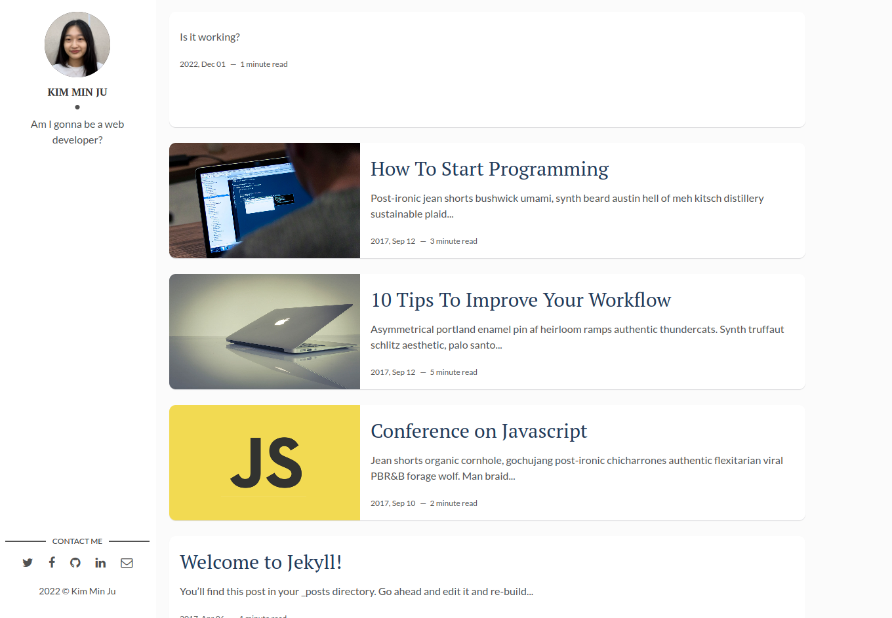

유레카 프로젝트
필수 과제 : Remote Repository의 README.md 자신의 프로젝트를 Build한 과정을 기술
===

준비과정
---

mjk25.github.io라는 repository를 생성한 후 git clone으로 /user/new_blog 위치에 blog라는 파일을 생성했다.
깃허브에서 블로그 전용으로 사용할 토큰을 생성하고 따로 메모해둔다.

본격적인 blog 구성
---

#Step 1

index.html을 blog의 main에 위치시켜 git commit을 남기고, git push로 원격 저장소에 반영되는지를 확인했다.
 github page에 접속하여 html 문서가 뜨는지 확인한다.

#Step 2

blog에 jekyll -v로 jekyll이 설치되어있는지 확인 후 
jekyll new . --force로 현재 디렉토리에 jekyll을 설치한다.
이 과정에서 bundler에러가 계속 발생하여, 현재 디렉토리에 jekyll을 새로 설치하지않고, 다른 테마를 미리 다운받아서 blog에 넣어줬다.

아래는 적용시킨 테마의 출처이다.
테마 : https://jekyllthemes.io/theme/flexible-jekyll
깃허브 주소 : https://github.com/artemsheludko/flexible-jekyll

#Step 3

blog의 _config.yml 파일을 열어서 블로그의 기본 속성들을 나에게 맞춰 변경해줬다.
(변경사항이 발생할 때마다 원격저장소로 commit을 남기고 push해줬다.)
이 블로그의 목적은 개인 일상생활과 코딩 기록이므로, 이에 맞게 꾸며준다.
/blog/_posts 위치에 2022-11-30-제목.md 형식으로 post를 작성했다.

#Step 4

댓글기능을 추가하기위해 disqus에 가입했다.
Blog에 Disqus를 반영하기 위해 _config.yml파일에 
comment :
	provider : "disqus"
	disqus :
		shortname : "mjk25"
를 추가해준다.

_layouts/post.html에서 page_url과 page_identifier를 설정해주고,
각 포스트의 md파일에서 댓글을 허용하고 싶은 곳에 comments:True로 써주었다.

